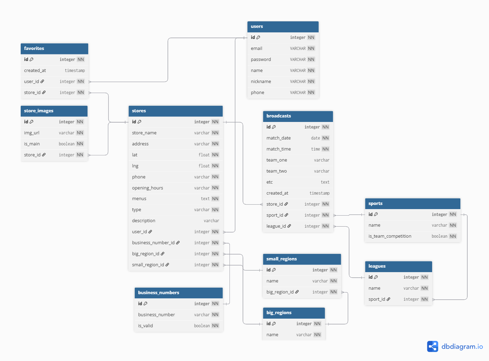

<details>
  <summary><strong>목차</strong></summary>
  
1. <a href="#-1-기술-스택">기술 스택</a><br>

2. <a href="#-2-폴더-구조">폴더 구조</a><br>
2.1 <a href="#21-프로젝트-폴더">프로젝트 폴더</a><br>
2.2 <a href="#22-src-폴더">src 폴더</a><br>
2.3 <a href="#23-seeds-폴더">seeds 폴더</a><br>
2.4 <a href="#24-k6-폴더">k6 폴더</a><br>

3. <a href="#-3-서버-실행">서버 실행</a><br>
3.1 <a href="#31-환경-변수-설정">환경 변수 설정</a><br>
3.2 <a href="#32-실행-방법">실행 방법</a><br>

4. <a href="#-4-db-설정">DB 설정</a><br>
4.1 <a href="#41-테이블-자동-생성">테이블 자동 생성</a><br>
4.2 <a href="#42-시드-설정-및-사용-방법">시드 설정 및 사용 방법</a><br>
4.3 <a href="#43-마이그레이션-사용-방법">마이그레이션 사용 방법</a><br>

5. <a href="#-5-erd--api-명세">ERD & API 명세</a><br>
5.1 <a href="#51-erd">ERD</a><br>
5.2 <a href="#52-api-명세">API 명세</a><br>

6. <a href="#-6-redis-캐시">Redis 캐시</a><br>

7. <a href="#-7-k6-부하테스트">K6 부하테스트</a><br>
7.1 <a href="#71-테스트-db">테스트 DB</a><br>
7.2 <a href="#72-실행-방법">실행 방법</a><br>
7.3 <a href="#73-테스트-대상-api-및-구조">테스트 대상 API 및 구조</a><br>

</details>


<br>

# 🛠️ 1. 기술 스택
<table border="1" cellpadding="5" cellspacing="0">
  <tr>
    <th>백엔드</th>
    <th>주요 컴포넌트 및 서비스</th>
  </tr>
  <tr>
    <td>
      - 언어 : TypeScript<br>
      - 서버 : Node.js + Express<br>
      - DB : MySQL<br>
      - ORM : TypeORM
    </td>
    <td>
      - 지도 API : 카카오맵 API<br>
      - 이미지 서버 : AWS S3<br>
      - 성능 테스트 : k6<br>
      - 모니터링 : AWS CloudWatch<br>
      - 캐싱/세션 관리 : Redis<br>
      - 배포 : AWS EC2 Instance
    </td>
  </tr>
</table>

# 🗂️ 2. 폴더 구조
## 2.1 프로젝트 폴더
```bash
📦 src/            # 핵심 소스 코드
📦 seeds/          # 더미 데이터
📦 k6/             # K6 부하테스트
├── .env               # 환경 변수 설정
├── .env.test          # 테스트용 환경 변수 설정
└── docker-compose.yml # Redis 개발용 인메모리 DB 설정
```
## 2.2 src 폴더
```bash
📦 src/
├── 📁 routes/            # 각 기능별 라우터
│   ├── userRoutes.ts         # 유저
│   ├── searchRoutes.ts       # 검색
│   ├── storeRoutes.ts        # 식당
│   ├── broadcastRoutes.ts    # 중계 일정
│   ├── favoriteRoutes.ts     # 즐겨찾기
│   └── staticdataRoutes.ts   # 사업자등록번호/지역/경기 등 고정 데이터
├── 📁 controller/        # 요청에 대한 간단한 처리 및 응답 (상태 코드, 에러 메세지 등)
│   ├── userController.ts     # 유저, 검색, 식당, 중계 일정, 즐겨찾기, DB 조회
│ 	│   ...
│   └── staticdataController.ts
├── 📁 service/           # 비즈니스 로직, 복잡한 유효성 검사, DB 트랜잭션 처리 등
│   ├── userService.ts        # 유저, 검색, 식당, 중계 일정, 즐겨찾기, DB 조회
│ 	│ 	...
│   ├── staticdataService.ts
├── 📁 docs/              # API 문서화 관련 
│   └── swagger.ts            # Swagger 설정 파일
├── 📁 entities/          # TypeORM 엔티티
│   ├── User.ts               # 유저, 식당, 식당 이미지, 중계 일정, 즐겨찾기
│   │   ...
│   ├── Favorite.ts  
│   ├── BusinessNumber.ts     # 사업자등록번호
│   ├── BigRegion.ts          # 지역 - 대분류  
│   ├── SmallRegion.ts        # 지역 - 소분류
│   ├── Sport.ts              # 경기 - 종목
│   └── League.ts             # 경기 - 리그
├── 📁 migrations/        # DB 마이그레이션 관련 (자동 생성)
├── 📁 middlewares/       # 공통 미들웨어 (인증, 요청 유효성 검사 등)
│   ├── authMiddleware.ts     # 로그인 인증/인가 
│   ├── validate.ts           # 요청 유효성 검사 처리 미들웨어
│   ├── userValidation.ts     # 유효성 검사 룰 정의 : 유저, 검색, 식당, 중계 일정
│   │   ...
│   └── broadcastValidation.ts
├── 📁 utils/             # 유틸 함수
│   ├── errorUtils.ts         # 에러 객체 생성 및 API 에러 로깅 함수
│   ├── response.ts           # API 응답 성공/실패 JSON 포맷 함수
│   ├── logUtils.ts           # 환경변수(LOG_ENABLED)에 따른 콘솔 로그 출력 제어 함수
│   ├── dateFormatter.ts      # 날짜를 KST(한국 시간) 기준의 포맷된 문자열로 변환하는 함수
│   ├── email.ts              # 인증 메일 발송용 Nodemailer 설정 및 메일 전송 함수
│   ├── kakaoAPI.ts           # 카카오맵 REST API 사용 함수
│   ├── locationUtils.ts      # 주소 기반 위치 정보 처리 함수 
│   ├── redis.ts              # Redis 클라이언트 관련 함수
│   ├── s3.ts                 # AWS S3를 활용한 이미지 업로드 및 삭제 함수
│   └── logger.ts             # AWS CloudWatch 연동을 위한 Winston 기반 로거 설정
├── data-source.ts        # TypeORM DB 연결 및 설정    
└── app.ts                # Express 앱 설정, 라우터 연결
```

## 2.3 seeds 폴더
```bash
📦 seeds/
├── index.ts      # DB 초기화 및 시드 데이터 일괄 실행
├── userSeeder.ts # 유저, 식당, 중계 일정, 즐겨찾기, 사업자등록번호, 지역, 경기
│   ...
└── sportLeagueSeeder.ts
```

## 2.4 k6 폴더
```bash
📦 k6/
├── 📁 scripts/    # k6 부하테스트 스크립트
│   ├── 📁 users/     # 유저, 식당, 중계 일정, 즐겨찾기, 고정 데이터
│   │   ├── join.success.test.js
│   │   │   ...
│   │   └── getMyInfo.success.test.js
│   │   ...
│   └── 📁 staticdata/
├── 📁 utils/      # 유틸 함수
│   ├── auth.js       # 로그인 요청 및 인증 토큰 발급 처리 함수
│   ├── common.js     # 부하테스트 옵션 설정, JSON 파싱, multipart 인코딩 등
│   └── factories.js  # mock 데이터 생성 함수
└── config.ts       # API 기본 URL, 공통 헤더 및 테스트용 상수 설정
```

# 🚀 3. 서버 실행
## 3.1 환경 변수 설정
⚠️ 환경 변수 설정 파일은 .gitignore에 추가해서 절대 깃에 커밋되지 않도록 주의해주세요.
### .env
```bash
# 서버
PORT=your_port                           # 예시 : 3000
BACKEND_LOCAL_URL=your_backend_local_url # 예시 : http://localhost:3000
BACKEND_PROD_URL=your_backend_prod_url
FRONTEND_LOCAL_URL=your_frontend_local_url
FRONTEND_PROD_URL=your_frontend_prod_url

# 설정
PRIVATE_KEY=your_private_key # dev에서는 단순 문자열(예시 : "secretKey"), production에선 보안 필요
LOG_ENABLED=true             # (테스트) 콘솔 로그 활성화 여부
MOCK_GEOCODING=false         # (테스트) 카카오맵 API 호출 대신 식당 관련 지역 데이터 mock 데이터 사용 여부

# DB
DB_HOST=your_db_host         # 예시 : localhost 또는 127.0.0.1
DB_PORT=your_db_port         # 예시 : 3306(MySQL default port)
DB_USERNAME=your_db_username # 예시 : root
DB_PASSWORD=your_db_password # 예시 : root
DB_NAME=your_db_name         # 예시 : Playce

# Redis
REDIS_HOST=your_redis_host # 예시 : localhost 또는 127.0.0.1
REDIS_PORT=your_redis_port # 예시 : 6379

# 카카오맵 API
KAKAO_REST_API_KEY=your_rest_api_key

# AWS
AWS_ACCESS_KEY_ID=your_aws_access_key_id
AWS_SECRET_ACCESS_KEY=your_secret_access_key
AWS_REGION=your_aws_region                 # 예시 : ap-northeast-2(서울)
AWS_S3_BUCKET_NAME=your_aws_s3_bucket_name # 예시 : playce-bucket

# 비밀번호 재설정 링크 메일 전송
EMAIL_USER=your_email_user
EMAIL_PASS=your_email_pass
```
### .env.test
```bash
...
LOG_ENABLED=false   # 콘솔 로그 비활성화
MOCK_GEOCODING=true # 카카오맵 API 호출 대신 mock 데이터 사용
...
DB_NAME=Playce-test # 테스트용 DB 이름 설정
...
```

## 3.2 실행 방법
```bash
# 1. .env 파일 설정
# .env 파일을 backend 폴더에 생성한 뒤 (3.1) 참고하여 필요한 값 설정

# 2. 의존성 설치
cd backend/
npm install

# 3. Redis 서버 연결 확인
docker ps            # redis 컨테이너가 실행 중인지 확인
docker-compose up -d # 실행이 안 되어 있다면 실행

# 4. DB 연결 확인
# 자세한 내용은 아래 (4. DB 설정) 참고

# 5. 서버 실행
npm run dev      # 개발 환경

npm run build    # 배포 환경
npm run start
```
- 서버 실행 성공 시 콘솔 로그 예시
```bash
설정 : .env 파일, 콘솔 로그(활성화), 식당 관련 지역 데이터(kakaoAPI 사용)
✅ Redis 연결 성공
📦 DB 연결 성공(TypeORM)
🚀 서버 실행 중 : # your_backend_prod_url
💡 Swagger 문서 : # your_backend_prod_url/api-docs
```

# 📦 4. DB 설정
## 4.1 테이블 자동 생성
```bash
# 1. .env 파일에 DB 접속 정보 등 설정

# 2. DB 스키마 생성
# .env 파일의 DB_NAME과 일치해야 함
CREATE SCHEMA `Playce`; 

# 3. 테이블 자동 생성 (초기 개발 시)
npm run migration:run

# 3.2 위 명령어로 생성이 안될 경우
# src/data-source.ts에서 synchronize: true로 변경
npm run dev
# 데이터 유실 방지를 위해 다시 synchronize: false로 변경 (⭐️ 중요)
```

## 4.2 시드 설정 및 사용 방법
```bash
# DB 초기화 & 더미 데이터 삽입
npm run seed
```
### 초기 개발 시
- 'seeds/index.ts' 파일에서 고정 데이터(사업자등록번호, 지역, 경기) 관련 주석 해제 후 더미 데이터 삽입
- 이후 고정 데이터 변경이 없으면 주석 처리하여 불필요한 작업 최소화

### 사업자등록번호 생성 개수 설정
  - 'seeds/businessNumberSeeder.ts' 파일의 businessNumbers 변수(52번째 줄)에서 설정
  - 하나의 사업자등록번호당 하나의 식당을 생성 가능. 필요한 만큼 설정 후 시드 실행

## 4.3 마이그레이션 사용 방법
### 마이그레이션 초기 설정
1. 'src/data-source.ts'에서 synchronize: false 확인
2. 'src/migrations/' 폴더가 없다면 생성

### DB 변경사항 발생 시
```bash
# 1. 엔티티 수정 등 DB 관련 코드 변경
# 시드 파일 수정은 마이그레이션 대상 아님

# 2. 마이그레이션 파일 생성
npm run migration:generate -- src/migrations/<설명>

# 3. 생성된 마이그레이션 파일 확인
# 형식 : 타임스탬프-설명
# 예시 : 1751948323873-modifyMenusType

# 4. DB에 변경사항 적용 후 확인
npm run migration:run

# 5.migrations 폴더 커밋
# 팀원 간 DB 구조 동기화를 위해 필수
```

# 📑 5. ERD & API 명세
## 5.1 ERD


## 5.2 API 명세
### Swagger
- Swagger UI를 통해 전체 API 확인 가능
- 서버 실행 후 http://localhost:3000/api-docs

### API 목록
<table border="1" cellpadding="5" cellspacing="0">
  <thead>
    <tr>
      <th>분류</th>
      <th>기능</th>
      <th>메서드</th>
      <th>엔드포인트</th>
      <th>토큰 필요 여부</th>
    </tr>
  </thead>
  <tbody>
    <!-- 유저 -->
    <tr>
      <td rowspan="6">유저</td>
      <td>회원가입</td>
      <td>POST</td>
      <td>/users/join</td>
      <td></td>
    </tr>
    <tr>
      <td>로그인</td>
      <td>POST</td>
      <td>/users/login</td>
      <td></td>
    </tr>
    <tr>
      <td>비밀번호 초기화 요청</td>
      <td>POST</td>
      <td>/users/reset</td>
      <td></td>
    </tr>
    <tr>
      <td>비밀번호 초기화</td>
      <td>PATCH</td>
      <td>/users/reset/:token</td>
      <td>△</td>
    </tr>
    <tr>
      <td>내 정보 조회</td>
      <td>GET</td>
      <td>/users/me</td>
      <td>O</td>
    </tr>
    <tr>
      <td>닉네임 변경</td>
      <td>PATCH</td>
      <td>/users/nickname</td>
      <td>O</td>
    </tr>
    <!-- 검색 -->
    <tr>
      <td rowspan="2">검색</td>
      <td>현재 위치 기반 검색</td>
      <td>GET</td>
      <td>/search/nearby</td>
      <td></td>
    </tr>
    <tr>
      <td>통합 검색</td>
      <td>GET</td>
      <td>/search</td>
      <td></td>
    </tr>
    <!-- 식당 -->
    <tr>
      <td rowspan="5">식당</td>
      <td>식당 등록</td>
      <td>POST</td>
      <td>/stores</td>
      <td>O</td>
    </tr>
    <tr>
      <td>식당 수정</td>
      <td>PATCH</td>
      <td>/stores/:storeId</td>
      <td>O</td>
    </tr>
    <tr>
      <td>식당 삭제</td>
      <td>DELETE</td>
      <td>/stores/:storeId</td>
      <td>O</td>
    </tr>
    <tr>
      <td>식당 상세 조회</td>
      <td>GET</td>
      <td>/stores/:storeId</td>
      <td></td>
    </tr>
    <tr>
      <td>내 식당 목록 조회</td>
      <td>GET</td>
      <td>/stores/mypage</td>
      <td>O</td>
    </tr>
    <!-- 중계 일정 -->
    <tr>
      <td rowspan="4">중계 일정</td>
      <td>중계 일정 등록</td>
      <td>POST</td>
      <td>/broadcasts</td>
      <td>O</td>
    </tr>
    <tr>
      <td>일정 삭제</td>
      <td>DELETE</td>
      <td>/broadcasts/:broadcasts_id</td>
      <td>O</td>
    </tr>
    <tr>
      <td>일정 수정</td>
      <td>PATCH</td>
      <td>/broadcasts/:broadcasts_id</td>
      <td>O</td>
    </tr>
    <tr>
      <td>가게 전체 일정 조회</td>
      <td>GET</td>
      <td>/broadcasts/stores/:store_id</td>
      <td></td>
    </tr>
    <!-- 즐겨찾기 -->
    <tr>
      <td rowspan="3">즐겨찾기</td>
      <td>즐겨찾기 추가</td>
      <td>POST</td>
      <td>/favorites/:store_id</td>
      <td>O</td>
    </tr>
    <tr>
      <td>즐겨찾기 삭제</td>
      <td>DELETE</td>
      <td>/favorites/:store_id</td>
      <td>O</td>
    </tr>
    <tr>
      <td>즐겨찾기 목록 조회</td>
      <td>GET</td>
      <td>/favorites</td>
      <td>O</td>
    </tr>
    <!-- 고정 데이터 -->
    <tr>
      <td rowspan="5">고정 데이터 조회</td>
      <td>사업자등록번호</td>
      <td rowspan="5">GET</td>
      <td>/staticdata/businessNumbers</td>
      <td></td>
    </tr>
    <tr>
      <td>지역 대분류</td>
      <td>/staticdata/bigRegions</td>
      <td></td>
    </tr>
    <tr>
      <td>지역 소분류</td>
      <td>/staticdata/smallRegions/:big_region_id</td>
      <td></td>
    </tr>
    <tr>
      <td>경기 종목</td>
      <td>/staticdata/sports</td>
      <td></td>
    </tr>
    <tr>
      <td>경기 리그</td>
      <td>/staticdata/leagues/:sport_id</td>
      <td></td>
    </tr>
  </tbody>
</table>

# 🧠 6. Redis 캐시
<table border="1" cellpadding="5" cellspacing="0">
  <thead>
    <tr>
      <th>분류</th>
      <th>API</th>
      <th>기능</th>
      <th>Redis 키 (등록/무효화)</th>
    </tr>
  </thead>
  <tbody>
    <!-- 유저 -->
    <tr>
      <td>유저</td>
      <td>로그인</td>
      <td>토큰 저장</td>
      <td>login:token:${token}</td>
    </tr>
    <!-- 검색 -->
    <tr>
      <td>검색</td>
      <td>통합 검색</td>
      <td>저장</td>
      <td>search:filters:${filtersHash}</td>
    </tr>
    <!-- 식당 -->
    <tr>
      <td rowspan="2">식당</td>
      <td>등록/수정/삭제</td>
      <td>무효화</td>
      <td>식당 상세 조회, 통합 검색, 즐겨찾기 조회</td>
    </tr>
    <tr>
      <td>상세 조회</td>
      <td>저장</td>
      <td>stores:${storeId}</td>
    </tr>
    <!-- 중계 일정 -->
    <tr>
      <td rowspan="2">중계 일정</td>
      <td>등록/수정/삭제</td>
      <td>무효화</td>
      <td>식당 상세 조회, 중계 일정 목록 조회, 통합 검색</td>
    </tr>
    <tr>
      <td>조회</td>
      <td>저장</td>
      <td>broadcasts:store:${storeId}</td>
    </tr>
    <!-- 즐겨찾기 -->
    <tr>
      <td rowspan="2">즐겨찾기</td>
      <td>등록/삭제</td>
      <td>무효화</td>
      <td>즐겨찾기 조회</td>
    </tr>
    <tr>
      <td>조회</td>
      <td>저장</td>
      <td>favorites:user:${userId}</td>
    </tr>
    <!-- 고정데이터 조회 -->
    <tr>
      <td rowspan="5">고정 데이터 조회</td>
      <td>사업자등록번호</td>
      <td rowspan="5">저장</td>
      <td>businessNumbers:all</td>
    </tr>
    <tr>
      <td>지역 대분류</td>
      <td>bigRegions:all</td>
    </tr>
    <tr>
      <td>지역 소분류</td>
      <td>smallRegions:${bigRegionId}</td>
    </tr>
    <tr>
      <td>경기 종목</td>
      <td>sports:all</td>
    </tr>
    <tr>
      <td>경기 리그</td>
      <td>leagues:${sportId}</td>
    </tr>
  </tbody>
</table>

- Redis 캐시 저장의 TTL의 경우, 고정 데이터는 1시간, 그 외는 5분

# 🧪 7 K6 부하테스트
## 7.1 테스트 DB
### 테스트 DB 생성 및 사용
- 테스트 시 많은 데이터 생성, 수정, 삭제가 일어날 수 있으므로 테스트 DB 사용 권장
- 'backend' 폴더에 .env.test 파일 생성 후 (3.1) 참고하여 필요한 값 설정
  - .env.test 파일을 사용해샤 테스트 환경에서 별도의 DB 사용, 연결 가능
  - .env 파일과 .env.test의 환경 변수 차이 확인
- DB_NAME은 테스트용 DB 이름으로 지정
- (4. DB 설정)을 참고하여 DB 생성 및 설정

### 테스트용 명령어
```bash
npm run migration:run:test
npm run seed:test
npm run dev:test
```

## 7.2 실행 방법
```bash
# 1. .env.test 파일 설정
# .env.test 파일을 backend 폴더에 생성한 뒤 (3.1) 참고하여 필요한 값 설정

# 2. Redis 서버 연결 확인
docker ps            # redis 컨테이너가 실행 중인지 확인
docker-compose up -d # 실행이 안 되어 있다면 실행

# 3. 테스트용 DB 연결 및 테이블, 시드 설정
# DB는 .env 파일의 설정 기준으로 연결됨
npm run migration:run:test # 테이블 생성
npm run seed:test          # DB 초기화, 더미 데이터 삽입 (선택)

# 4. 서버 실행
npm run dev:test

# 5. 부하테스트 옵션 확인, 변경 (utils/common.js)

# 6. 부하테스트 실행 예시 (별도 터미널)
k6 run scripts/users/join.success.test.js # 'backend/k6' 기준
k6 run join.success.test.js               # 'backend/k6/scripts/users' 기준
```

- 테스트 실행 전 DB 정리
  - npm run seed:test
  - 특히 유저 등록의 경우, 삭제가 안되기 때문에 DB 정리 필수
- 'k6/config.js'
  - 테스트용 상수 설정 파일
  - 로그인 후 사용 가능한 API의 경우 해당 파일에서 설정된 이메일, 비밀번호 사용 중
- 'k6/utils/common.js'
  - getOptions 함수의 설정이 전체 API 부하테스트에 일괄 적용 중
  - 필요한 옵션으로 설정 변경 가능

## 7.3 테스트 대상 API 및 구조
### API 테스트 파일 기본 구조
```js
const CONTEXT = '...'; // 어떤 API인지 명시
export const options = getOptions(); // 테스트 옵션 설정

// 테스트 유닛 함수
export const XXXSuccessTest = () => {
  // 특정 API 기능 검증 코드
}

// setup 함수 : 테스트 실행 전 초기 환경 설정 및 데이터 준비
export function setup () {
  const token = getTokenOrFail(); // 로그인이 필요한 API의 경우
  return { token };               // 이후 default 함수에서 사용 가능
} 
// 테스트 실행 진입 함수 (k6가 자동 호출)
export default function (data) {
  // 테스트 환경 세팅 및 유닛 함수 호출
}

```

### API 테스트 유형

<table border="1" cellpadding="5" cellspacing="0">
  <tr>
    <td>생성(create)</td>
    <td>mock 데이터 생성(factories.js), 테스트 종료 시 자동 삭제(cleanupAfterTest 변수)</td>
  </tr>

  <tr>
    <td>삭제(delete)</td>
    <td>테스트 전용 데이터 생성 후 삭제</td>
  </tr>

  <tr>
    <td>조회/수정(read/update)</td>
    <td>기존 데이터 기준으로 테스트</td>
  </tr>
</table>

- API 테스트의 유닛 함수를 이용해 여러 API 흐름을 유저 행동처럼 조합해 시나리오 테스트 코드 작성 가능