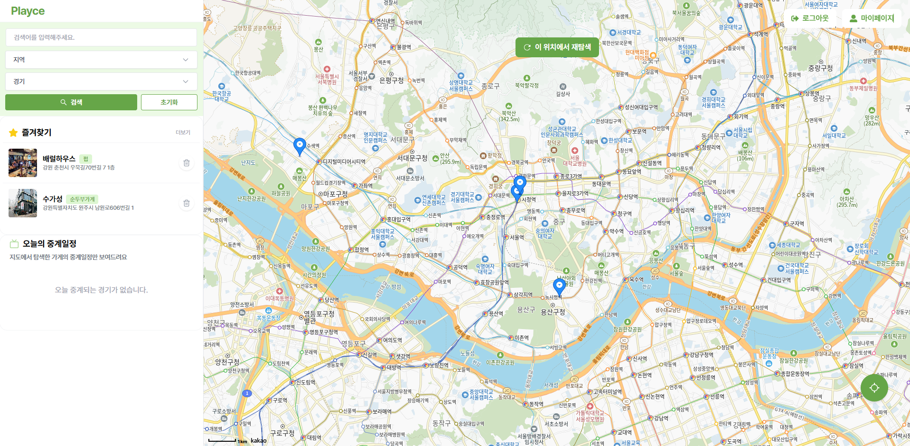
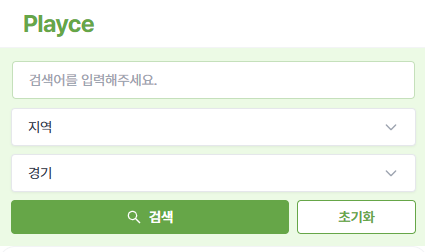
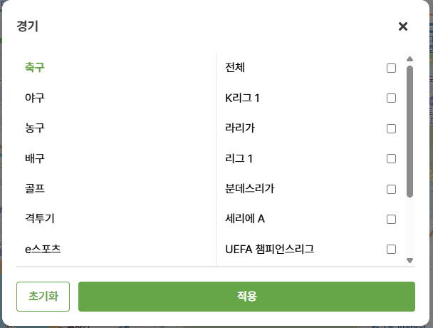
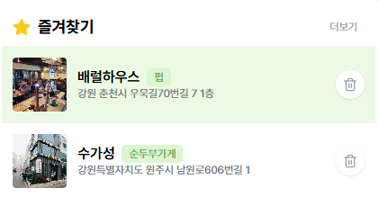
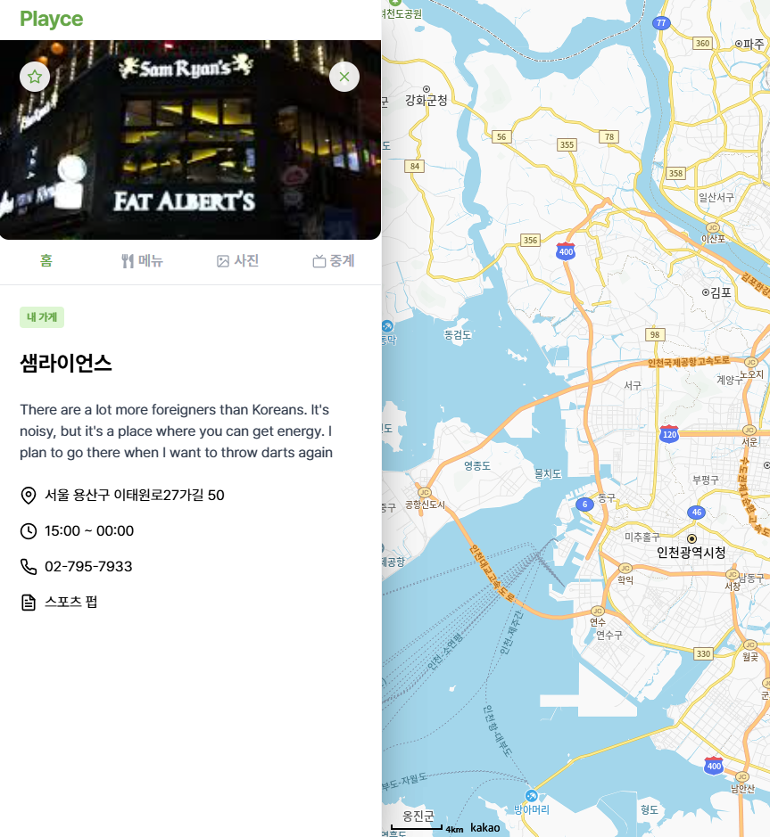
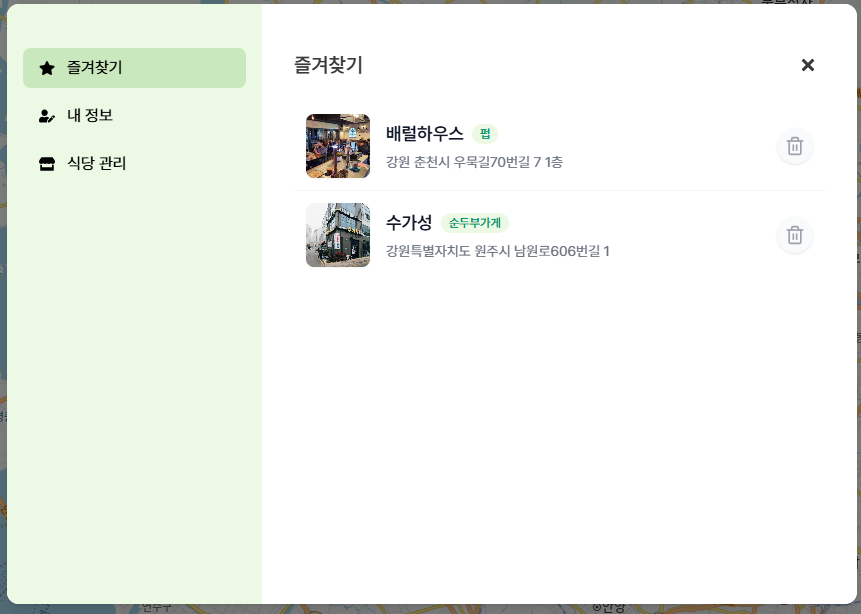
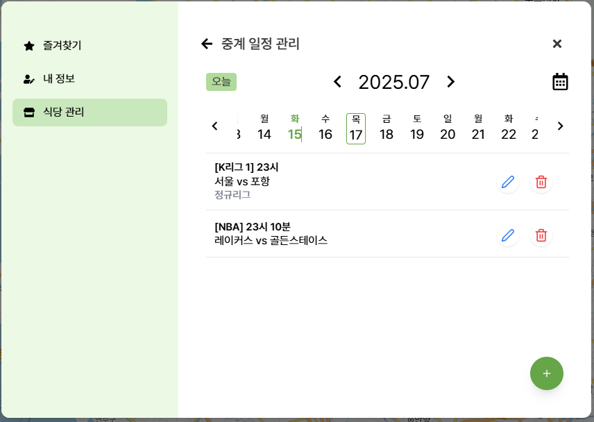
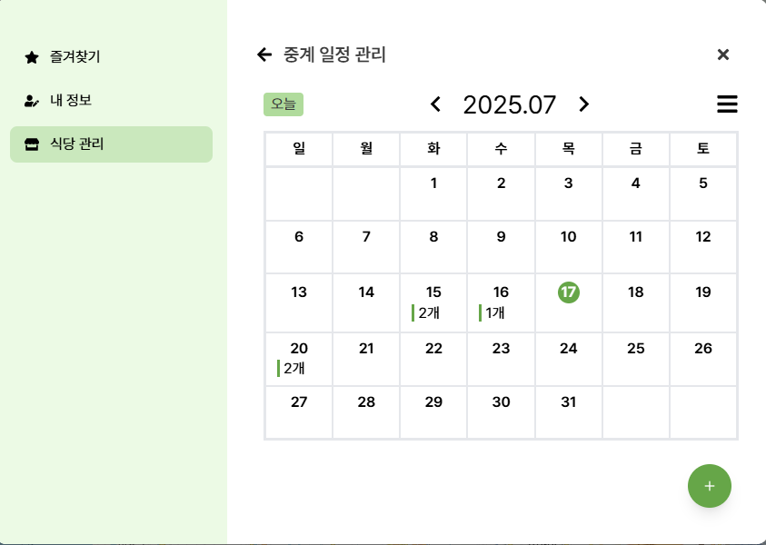
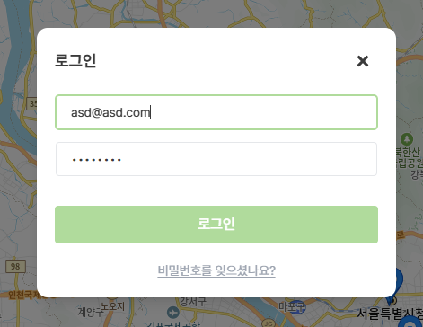
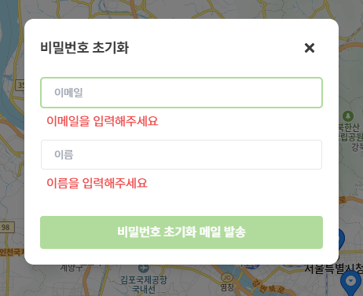

# ⚽ Playce (Frontend)

> 사용자 위치 기반의 식당 검색과 스포츠 중계 정보 제공을 결합한 플랫폼 **Playce**의 프론트엔드 레포지토리입니다.  
> React 기반의 **SPA(Single Page Application)**으로, 지도 기반 UI와 경기, 종목별 통합 검색 기능, 식당 즐겨찾기 기능, 식당별 중계 내용과 중계 관리 기능까지 다양한 기능을 제공합니다.
> 
> 🔗 배포 주소: http://3.35.146.155:3000/

---

## 🛠️ 기술 스택

| 분류        | 기술                 |
| ----------- | -------------------- |
| 프레임워크  | React 18, TypeScript |
| 상태관리    | Zustand              |
| 네트워크    | Axios, qs            |
| 스타일      | Tailwind CSS         |
| UI 컴포넌트 | React Icons          |
| 맵 API      | Kakao Maps SDK       |
| 인증/계정   | JWT                  |
| 라우팅      | React Router DOM     |
| 배포        | AWS EC2            |

---

## 📁 프로젝트 구조

```plaintext
📦 frontend/src
├── api          # 서버 통신 (fetch/axios 모듈화)
├── components   # 공통 컴포넌트 및 UI 요소
├── constants    # 상수 데이터 (위치 좌표 등)
├── data         # 지역/스포츠 분류 데이터 및 관련 유틸 함수
├── hooks        # 커스텀 훅
├── pages        # 라우팅되는 주요 페이지
├── stores       # Zustand 기반 전역 상태 관리
├── types        # TypeScript 타입 정의
├── utils        # 유틸 함수 (좌표 변환, 시간 포맷, 중계 검색 결과 정렬 등)
```

## 🚀 주요 기능

### 🧭 SPA 구조 & 레이아웃 구성

- 프로젝트는 **SPA** 구조로 구성되며, 주요 UI는 다음과 같은 **레이아웃 기반으로 구동**됩니다:



- 좌측 사이드바 (로고 + 통합검색 + 즐겨찾기 + 오늘의 중계)
- 우측 지도 (로그인, 회원가입, 마이페이지, 지도 핀, 모달)

---

### 🧩 기능 상세

#### 📍 위치 기반 식당 탐색


- 현재 위치를 기준으로 지도에 등록된 식당 핀 표시
- 지도에 표시된 식당은 사장이 사업자등록번호 검증 후 직접 등록한 곳만 노출
- 지도 핀 클릭 시 모달로 상세 정보 + **가까운 경기 중계 정보** 표시
- `상세보기` 버튼 클릭 시 식당 전용 상세 페이지로 이동

#### 🔍 통합 검색





<br>

- **사이드바 최상단**에 위치
- 검색어 입력 또는 조건 기반 검색 지원
  - 지역: 시 → 구 (예: 서울 > 강남구)
  - 종목: 축구, 농구, 야구, 배구, 골프, 격투기, e스포츠 등
  - 리그: 종목별 하위 리그 선택 가능 (예: K리그, 챔스 등)
- 결과는 필터 기준에 부합하는 **중계 포함 식당 리스트**
  - 정렬 옵션: 거리순 / 날짜순
  - 클릭 시 상세보기 페이지로 이동

#### ⭐ 즐겨찾기



- 로그인한 사용자가 즐겨찾기한 식당 리스트 제공
- 상단 사이드바에서 빠르게 접근 가능

#### 📅 오늘의 중계


- 현재 날짜에 중계가 포함된 식당만 필터링하여 리스트로 제공
- 클릭 시 해당 식당의 상세정보로 이동

#### 🏠 식당 상세 페이지



- 탭 구성: `홈`, `메뉴`, `사진`, `중계`
  - **홈 탭**: 식당 기본 정보 (이름, 주소, 영업일자, 전화번호 등)
  - **중계 탭**: 중계 일정 확인
    - 사장 계정일 경우: `중계 관리 탭` 활성화
    - 미래 중계는 가까운 일정 순서로 정렬
    - 지난 중계는 토글로 숨김/표시 가능

#### 👤 마이페이지



- 메뉴 구성: `내 정보`, `즐겨찾기`, `식당 관리`
  - **식당 관리**: 내가 등록한 식당의 중계 일정 관리 진입 가능

#### 🗓️ 중계 일정 관리 (사장용)




- 사장이 등록한 식당에 한해 중계 등록/수정/삭제 가능
- 뷰 타입: `캘린더형 보기` + `리스트형 보기` 제공
- 오늘 버튼 클릭 시 오늘 날짜로 빠른 이동 가능

#### 🔐 인증 / 로그인




- 이메일 기반 회원가입/로그인
- 비밀번호 분실 시 **이메일로 초기화 링크 전송** 방식 제공

---

## ⚙️ 로컬 개발 환경 세팅

```bash
# 패키지 설치
npm install

# 개발 서버 실행
npm run dev
```

### 🔐 .env 설정

`.env` 파일에 다음을 추가해야 정상 실행됩니다:

```
VITE_KAKAO_MAP_KEY=your_kakao_map_api_key
```

---

## 🧩 브랜치 & 커밋 컨벤션

### 🔀 브랜치 네이밍

```
FE/#이슈번호/기능설명
```

예시:

```
FE/#12/중계-일정-탭-구현
```

### ✅ 커밋 메시지 규칙

| 태그     | 설명                   |
| -------- | ---------------------- |
| Feat     | 기능 추가              |
| Fix      | 버그 수정              |
| Style    | 스타일 변경 (로직 X)   |
| Refactor | 코드 리팩토링          |
| Docs     | 문서 수정              |
| Chore    | 설정 파일 수정 등 기타 |

예시:

```
Feat: 오늘의 중계 리스트 추가
Fix: 중계 탭에서 지난 경기 표시 오류 수정
```

---

## 📌 기타

- 모든 페이지는 **React Router 기반 SPA 구조**로 구성되어 빠른 화면 전환이 가능합니다.
- API 연동은 백엔드 Swagger 명세 기반으로 이루어졌으며, axios와 qs를 활용해 HTTP 요청 및 파라미터 직렬화를 처리합니다.
- UI는 `Figma` 기반 시안에 맞춰 제작되었으며, 향후 화면은 반응형 대응을 고려하여 개발할 예정입니다.

---

> 본 문서는 프로젝트의 프론트엔드 구조 및 주요 기능 흐름을 빠르게 이해하고 개발 및 유지보수를 용이하게 하기 위한 개발자 가이드입니다.
